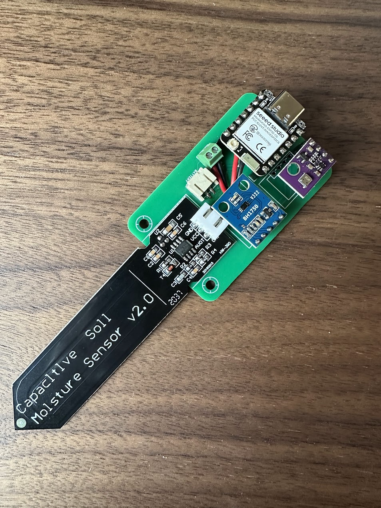

# Zigbee Plant Sensor

This repository contains a project for creating a Zigbee Plant Sensor end device. The end goal is to create an energy efficient, battery powered solution for monitoring house plants. The device should be battery powered, and ideally last 2 months on a 1200 mAh battery.

## Electrical Hardware
The current version of the device uses the following components:

- Custom PCB (Part of this repository)
- XIAO ESP32-C6
- AHT30 breakout module
    - Can be subsituted for a BME280 if a barometer is desired
- BH1750 breakout module
- HW390 capacitive moisture sensor
- 2x 200k Ohm resistors
- 2x 4 pin female header
- 2x 7 pin female header
- 2 pin screw terminal
- JST-PH female SMD connector
- LiPo battery with JST-PH connector (I use [this](https://www.kjell.com/no/produkter/elektro-og-verktoy/elektronikk/utviklerkit/arduino/arduino-tilbehor/luxorparts-li-po-batteri-37-v-med-kontakt-1200-mah-p87924?utm_source=google&utm_medium=cpc&utm_campaign=NO%20%7C%20UP%20%2D%20PM%20%7C%20Standard%20Shopping&gad_source=1&gad_campaignid=22408336754&gbraid=0AAAAADcA9cwSsVdVY3-c_zMYl5YBUjPP6&gclid=Cj0KCQjwlrvBBhDnARIsAHEQgOTxmvMeDbw0Wd1paJ639T4glH6r-rYMUwSAXwGE7Fnmn12A9cEwYLIaAo7JEALw_wcB))

## Software
The current version of the software is developed using the Arduino platform, and is delivered in the form of a single sketch. Required libraries are:

- Zigbee from [Espressif's ESP32 Arduino Board](https://github.com/espressif/arduino-esp32)
- AHT20 from [AHT20](https://github.com/dvarrel/AHT20)
- BH1750 fom [BH1750](https://github.com/claws/BH1750)

## Mechanical Hardware
The current casing can be 3D printed using the STLs in the 3d-prints folder. I have succesfully printed these in PETG, however the casing is hard to assemble without breaking. The design has to be improved. Known issues:

- Lid is hard to attach as the lips on the casing are fragile
- The PCB cannot be angled enough with the PCB through the slit to slide onto the sticks

## Assembly Instructions

1. Solder the following components onto the PCB:
    - 7-pin headers
    - 4-pin headers
    - 2-pin screw terminal
    - JST-PH female SMD connector
    - HW390 moisture sensor

2. Solder a positive and negative wire to the battery pins of the XIAO ESP32-C6

3. Connect the wires of the XIAO ESP32-C6 to the screw terminal. Note the polarity!

4. Mount the AHT30/BME280 and the BH1750 to the 4-pin headers. The PCB is now ready.

